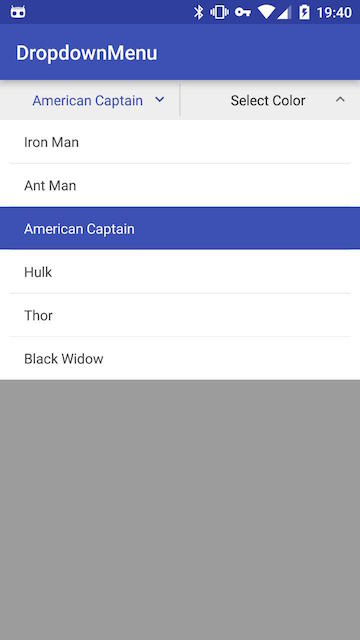

# DropdownMenu View

基于 ListView 和 PopupWindow 实现的下拉菜单，可以方便的配置样式和填充数据。



## 使用

layout:

```xml
<com.twiceyuan.dropdownmenu.DropdownMenu
    android:id="@+id/dm_dropdown"
    android:layout_width="0dp"
    android:layout_height="40dp"
    android:layout_weight="1"
    dm:highlightColor="@color/colorPrimary"
    dm:iconColor="#777"
    dm:titleBgColor="#eee"
    dm:titleText="默认选项"
    dm:titleTextSize="14"/>
```

java:

```java
DropdownMenu menu = (DropdownMenu) findViewById(R.id.dm_dropdown);
menu.setAdapter(new ArrayDropdownAdapter(this, R.layout.light_dropdown_item_1line, HEROES)); 
menu.setOnItemClickListener(new OnDropdownItemClickListener() {
    @Override public void onItemClick(AdapterView<?> parent, View view, int position, long id) {
        Toast.makeText(getApplicationContext(), HEROES[position], Toast.LENGTH_SHORT).show();
    }
});

// 同时只允许一个 DropdownMenu 为打开状态
MenuManager.group(menu, menu2);
```

## 依赖

```groovy
allprojects {
    repositories {
        maven { url "https://jitpack.io" }
    }
}

dependencies {
    compile 'com.github.twiceyuan:DropdownMenu:1.1.0'
}
```

## 更新日志

### update 1.1.0

1. 修改上下图标箭头为字体图标（仅有两个字符 1KB 左右的字体文件不会造成资源浪费）
2. 上下箭头可以通过 iconColor 来设置颜色
3. DropdownMenu 的 title 文字选中时（下拉菜单弹出）时的颜色可以通过 highlightColor 来配置
4. 增加 sample 里 list adapter 设置单选的效果

### update 1.0.4

解决在低版本上面点击事件不响应的问题。

### update 1.0.3

1. 添加手动弹出和关闭的方法
2. 添加管理工具类来实现同时只允许一个窗口为弹出状态

### update 1.0.2

1. 选择其中一项后改变标题文字（需要适配器实现 DropdownAdapter 接口）
2. 在 PopupWindow 打开时点击标题收起
3. Java 中设置默认标题文字