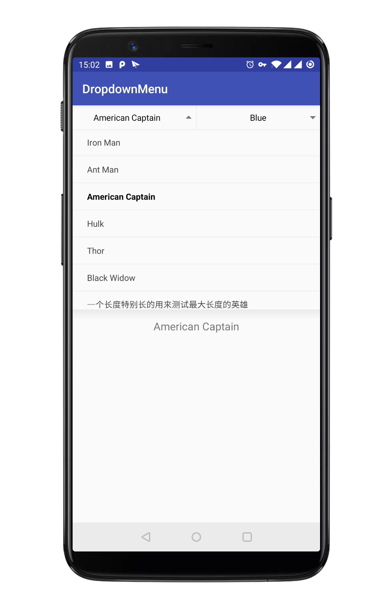
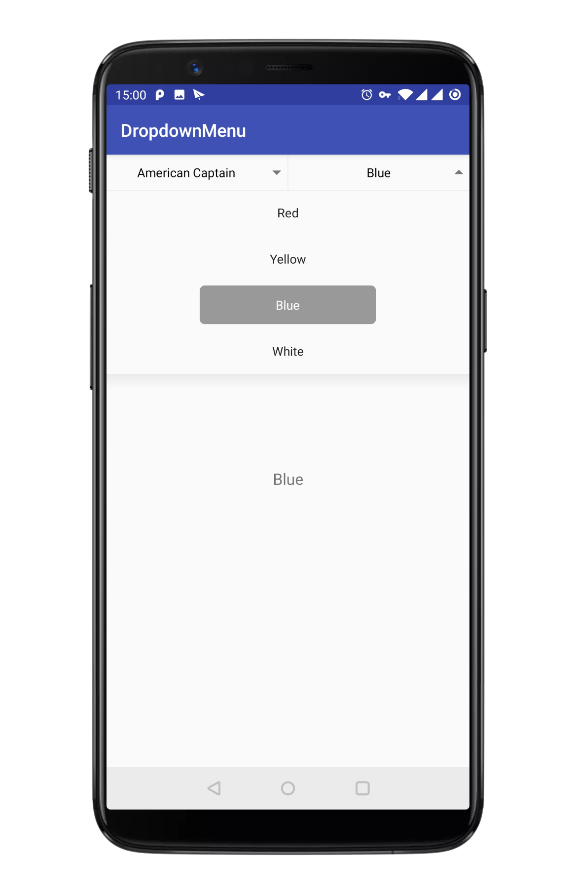

# DropdownMenu View 
[](https://jitpack.io/#twiceyuan/DropdownMenu)

基于 PopupWindow 的下拉菜单控件，可以方便的配置样式和填充数据。

<p align="center">
    
    
</p>

## 使用

```java
new DropdownMenu.Builder<String>()
        .header(new TextViewHeader(tvChooseHero))                  // 默认头部交互
        .content(new DropListContent(this, Arrays.asList(HEROES))) // 默认菜单样式
        .build()
        .setOnChooseListener(textContent::setText);
```

自定义样式和交互：

参考 `TextViewHeader` 和 `DropListContent` 实现

## 依赖

```groovy
allprojects {
    repositories {
        maven { url "https://jitpack.io" }
    }
}

dependencies {
    compile 'com.github.twiceyuan:DropdownMenu:1.1.6'
}
```

## 更新日志

### update 1.1.6

优化下拉菜单标题的显示，在其长度过长时显示省略号。同时增加获得标题文本 TextView 的方法，方便使用时进一步微调

### update 1.1.5

切换图标，调整细节

### update 1.1.3

1. 添加 library 中的源码
2. 修复选择后获取不到 title 的问题

### update 1.1.1

添加自定义下拉布局的支持，添加二级联动的例子

### update 1.1.0

1. 修改上下图标箭头为字体图标（仅有两个字符 1KB 左右的字体文件不会造成资源浪费）
2. 上下箭头可以通过 iconColor 来设置颜色
3. DropdownMenu 的 title 文字选中时（下拉菜单弹出）时的颜色可以通过 highlightColor 来配置
4. 增加 sample 里 list adapter 设置单选的效果

### update 1.0.4

解决在低版本上面点击事件不响应的问题。

### update 1.0.3

1. 添加手动弹出和关闭的方法
2. 添加管理工具类来实现同时只允许一个窗口为弹出状态

### update 1.0.2

1. 选择其中一项后改变标题文字（需要适配器实现 DropdownAdapter 接口）
2. 在 PopupWindow 打开时点击标题收起
3. Java 中设置默认标题文字
