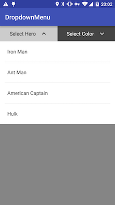
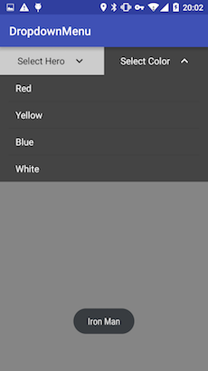

# Dropdown Menu View

Use popup window to choose data as easy as ListView

## Usage

layout code:

```xml
<com.twiceyuan.dropdown_menu.DropdownMenu
        android:id="@+id/dm_dropdown"
        android:layout_weight="1"
        android:layout_width="0dp"
        android:layout_height="48dp"
        app:iconColor="dark"
        app:titleText="Select Hero"
        app:titleTextSize="16"/>
```

java code:

```java
        // Bind layout id
        DropdownMenu menu1 = (DropdownMenu) findViewById(R.id.dm_dropdown);

        // Configure adapter
        menu1.setAdapter(new ArrayAdapter<>(
                this,
                android.R.layout.simple_dropdown_item_1line,
                new String[]{"Iron Man", "Ant Man", "American Captain", "Hulk"}
        ));

        // Configure click listener
        menu1.setOnItemClickListener(new OnDropdownItemClickListener() {
            @Override
            public void onClick(int position) {
                Toast.makeText(getApplicationContext(), strings[position], Toast.LENGTH_SHORT).show();
            }
        });
```

## Screenshot



